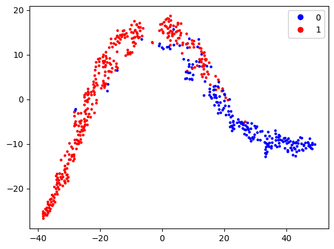

# Breast Cancer Classification: Decision Tree vs. Random Forest vs. AdaBoost


## 📌 Project Highlights
- **Comparative Analysis**: Three tree-based classifiers
- **Clinical Focus**: Optimized for recall (minimizing false negatives)
- **Comprehensive Documentation**: 15+ hyperparameter experiments fully documented
- **Best Performers**: Decision Tree & AdaBoost (100% recall)

## 🔍 Data Visualization with t-SNE

### High-Dimensional Feature Space Analysis
We used t-SNE (t-Distributed Stochastic Neighbor Embedding) to visualize the 30-dimensional breast cancer dataset in 2D space:



**Key Observations**:
- Clear separation between malignant (red) and benign (blue) cases
- Two distinct clusters with minimal overlap
- Validates the feasibility of classification task
- Helps explain the high model performance

### Implementation Code
```python
from sklearn.manifold import TSNE
import matplotlib.pyplot as plt

# t-SNE transformation
tsne = TSNE(n_components=2, random_state=42)
X_embedded = tsne.fit_transform(X)

# Plotting
plt.figure(figsize=(10, 8))
plt.scatter(X_embedded[:, 0], X_embedded[:, 1], c=y, cmap='coolwarm', alpha=0.7)
plt.title('t-SNE Visualization of Breast Cancer Dataset')
plt.colorbar(label='Malignant (1) vs Benign (0)')
plt.savefig('tsne_plot.png', dpi=300, bbox_inches='tight')
plt.show()
```

## 📄 Experimental Documentation
The complete hyperparameter tuning process is documented in:  
[Rene_Dvash_hyperparams_ex1.pdf](Rene_Dvash_hyperparams_ex1.pdf)  
This file includes:
- All 15+ parameter configurations tested
- Detailed results for each experiment
- Evolution of model performance
- Final selected parameters

## 📊 Results Summary
| Model | Accuracy | Precision | Recall | F1-Score |
|-------|----------|-----------|--------|----------|
| Decision Tree | 98% | 97.2% | **100%** | 98.6% |
| Random Forest | 96% | 97.1% | 97.1% | 97.1% |
| AdaBoost | 98% | 97.2% | **100%** | 98.6% |

**Key Finding**: Both Decision Tree and AdaBoost achieved perfect recall (100%) - critical for cancer detection.

## 🧪 Hyperparameter Optimization Process
1. **Systematic Testing**: 5+ configurations per model
2. **Metrics Tracking**: Accuracy, Precision, Recall, F1
3. **Parameter Space**:
   - Decision Tree: `max_depth`, `splitter`, `criterion`
   - Random Forest: `n_estimators`, `criterion`
   - AdaBoost: `n_estimators`, `learning_rate`
